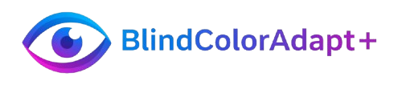

# 

## Setup

Clone this repo:

```sh
git clone <this-repo>
```

Setup laravel:

```sh
cd <this-repo>
# Install Dependency
composer install
npm install && npm run build
# Create .env
cp .env.example .env
# Generate App Key
php artisan key:generate
# Migrate Database (Optional)
php artisan migrate
```

Run:

```sh
composer run dev
```

Setup chatbot:

Buat API Key di [AI Studio](https://aistudio.google.com/apikey).

Unduh sertifikat SSL (untuk jaga-jaga) [di sini](https://curl.se/ca/cacert.pem).

Ubah file .env.

```.env
...
GEMINI_API_KEY=your_api_key_here
CURL_CA_BUNDLE_PATH=<your-path>/cacert.pem
SSL_VERIFY=false
```

## Todo

UI: 
- [x] Homepage
- [x] Login
- [x] Register
- [x] UI Recolor Assistant
- [x] WarnaBot
- [x] Visual Simulator
- [x] Tes Diagnosis
- [x] Direktori Dokter & Rujukan
- [x] Pusat Edukasi
- [ ] Responsive Design

Feature:
- [ ] Login/Register
- [x] Extension (Ongoing)
- [x] AI Chatbot
- [x] Visual Simulator (Static Page)
- [ ] Tes Diagnosis

## License

This project is licensed under the MIT License - see the [LICENSE](LICENSE) file for details.
